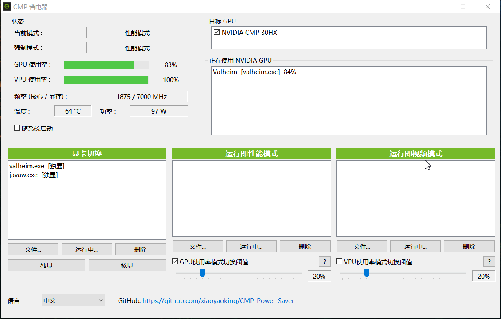
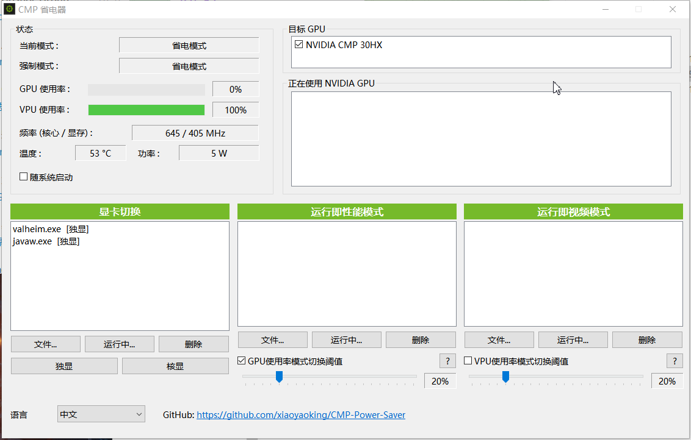

# Docs

| Language | Guide |
|----------|--------|
| 中文 | [使用说明](docs/使用说明.md) |
| English | [User Guide](docs/User-Guide.md) |

# CMP 省电器 — 使用说明

**版本：0.1.0（测试版）**  
仓库：[https://github.com/xiaoyaoking/CMP-Power-Saver](https://github.com/xiaoyaoking/CMP-Power-Saver)

English: [User Guide](docs/User-Guide.md)

> 测试版功能可能继续调整。请了解风险后再使用。

---

## 界面一览

负载较高、处于性能模式时：

空闲、处于省电模式时：

---

## 1. 这是做什么的？

面向 NVIDIA 显卡（尤其是 CMP 挖矿卡）的小工具：

1. **强制功耗档位（模式）**
   - **省电模式**：降低功耗档位
   - **性能模式**：放开到高性能档位
   - **视频模式**：视频类负载用的档位（默认接近省电，可在配置中修改）

2. **自动切换**
   - 名单中的程序在运行 → 强制对应模式
   - 或按整卡 GPU / VPU 使用率阈值切换

3. **显卡切换（独显 / 核显）**  
   通过 Windows 图形性能偏好，为指定程序选择独显或核显（需重启该程序后生效）。

4. **状态监视**  
   当前/强制模式、使用率、频率、温度、功率，以及正在使用 NVIDIA GPU 的进程。

---

## 2. 运行环境

- Windows 10 / 11（x64）
- 已安装可用的 NVIDIA 驱动
- 本机至少有一块 NVIDIA GPU

说明：

- **目标 GPU** 在启动时由 NVAPI **动态枚举**。
- 魔改驱动下，任务管理器可能显示成其它型号（如 1660），本软件仍可能显示 CMP 30HX——通常是同一张卡。
- **CMP 30HX 等挖矿卡通常没有可用视频编解码引擎（VPU）**。「VPU 使用率模式切换阈值」对这类卡基本无效。

---
