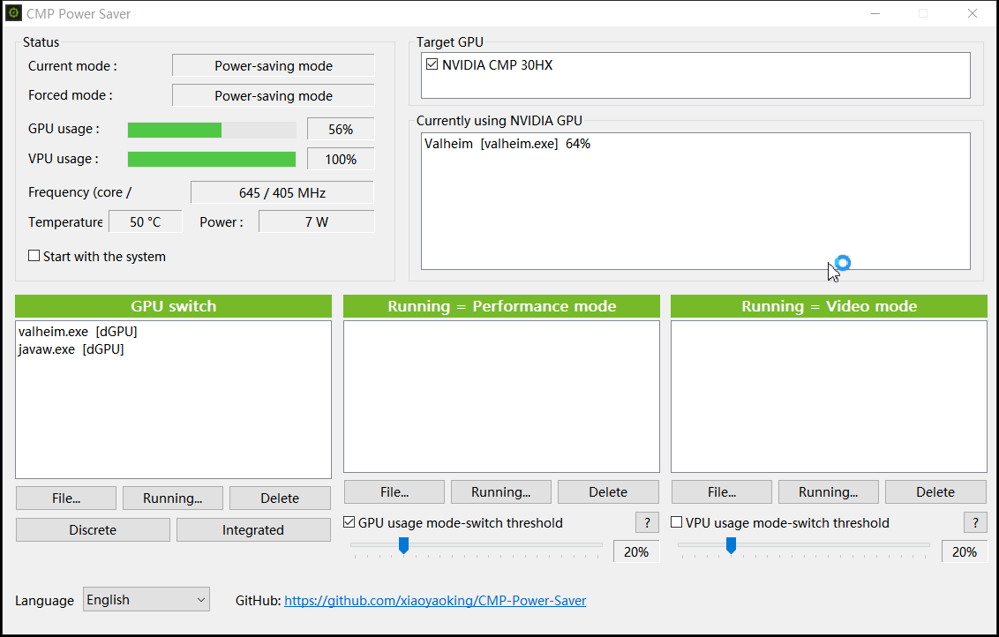
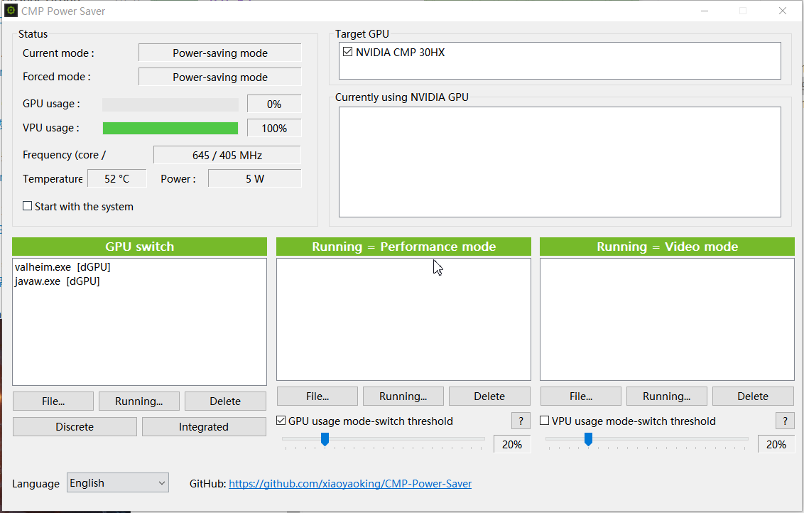

# CMP Power Saver — User Guide

**Version: 0.1.0 (Beta)**  
Repository: [https://github.com/xiaoyaoking/CMP-Power-Saver](https://github.com/xiaoyaoking/CMP-Power-Saver)

中文：[使用说明](使用说明.md)

> This is a beta build. Features and wording may still change. Use at your own risk.

---

## Screenshots

Under load / Performance mode:

Idle / Power-saving mode:

---

## 1. What it does

A small utility for NVIDIA GPUs (especially CMP mining cards):

1. **Force power modes**
   - **Power-saving mode** — lower power limit
   - **Performance mode** — high-performance limit
   - **Video mode** — for video-style workloads (defaults near power-saving; editable in config)

2. **Automatic switching**
   - Listed apps force a mode while running
   - Or switch by whole-card GPU / VPU usage thresholds

3. **GPU switch (Discrete / Integrated)**  
   Sets Windows graphics preference per app (restart the app for it to apply).

4. **Status monitoring**  
   Current/forced mode, usage, clocks, temperature, power, and processes using the NVIDIA GPU.

---

## 2. Requirements

- Windows 10 / 11 (x64)
- Working NVIDIA driver
- At least one NVIDIA GPU

Notes:

- **Target GPU** list is **enumerated at startup** via NVAPI.
- With modified drivers, Task Manager may show another name (e.g. 1660) while this app still shows CMP 30HX — often the same card.
- **CMP 30HX-class mining cards usually have no usable video engine (VPU).** The VPU usage threshold is generally useless on those cards.

---

## 3. Install & run

1. Run `cmp-power-saver.exe`.
2. `config.yaml` is used/created next to the exe.
3. Optionally enable **Start with the system**.
4. Closing the window minimizes to the tray by default.

---

## 4. UI sections

### Status

| Item | Meaning |
|------|---------|
| Current mode | Mode reported by the driver (friendly name) |
| Forced mode | Mode this app is currently applying |
| GPU / VPU usage | NVAPI whole-card domain usage (not the same math as Task Manager) |
| Frequency / Temperature / Power | Sensor readings |

If Task Manager percentages disagree with this app, it is usually **different metrics**, not necessarily a bug.

### Target GPU

Only checked GPUs receive limits. Selection is saved in config.

### Currently using NVIDIA GPU

Per-process NVIDIA GPU engine usage (another data source than the Status bars).

### GPU switch

Assign Discrete / Integrated preference. Restart the target program afterward.

### Running = Performance / Video mode

Listed apps force that mode while running.  
Priority is roughly: **Performance > Video > idle (Power-saving)**.

### GPU / VPU usage mode-switch threshold

Enable the checkbox; slider steps are 5%. Use **?** for the full tip.

- GPU: above → Performance; below → Power-saving  
- VPU: above → Video; below → Power-saving  

---

## 5. Suggested setup (CMP 30HX)

1. Check your CMP card under **Target GPU**.
2. Add games to **Running = Performance mode**, or enable the GPU usage threshold (e.g. 15–30%).
3. On dual-GPU laptops, use **GPU switch** for Discrete / Integrated.
4. Do not rely on the VPU threshold.

---

## 6. Config file

`config.yaml` stays in sync with the UI. The GitHub URL is **built into the binary**, not stored in config.

---

## 7. FAQ

**Task Manager usage differs a lot?**  
Different counters; modified drivers may also rename the device.

**Forced mode does nothing?**  
Confirm the correct Target GPU is checked, and no other tool is also changing P-states.

**Discrete / Integrated has no effect?**  
Restart the app; Windows/driver may ignore the preference on some setups.

---

## 8. Disclaimer

Beta software may affect power, temperature, and stability. Use at your own risk.
